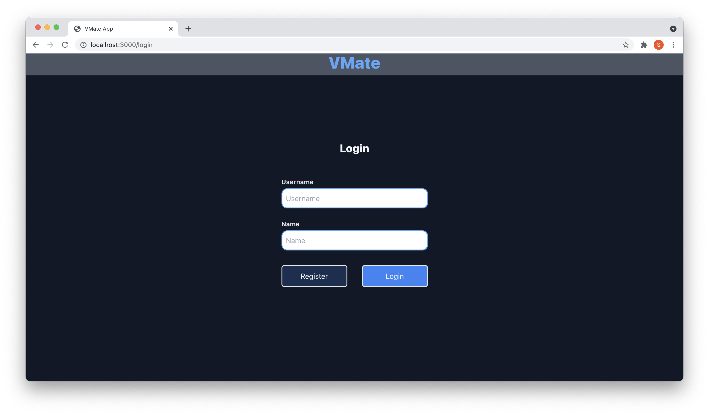

# Getting Started with VMate

This webapp is made for Assignment for Mortorq selection process.

## [Demo Of the Website](https://drive.google.com/file/d/1w6g-LfoVTvn4aVmb8_MTBQmvZEH6Ezu8/view?usp=sharing)

## Some Screenshots from the VMate Webapp.

### Login Page   

Enter Registration number and name to login. If not a user use the register option   
</img>

## How to compile and run This webapp

This web app is already hosted on [VMate](https://vmate.herokuapp.com/). This deployment still have some issues to fix. Untill Then use the local run guide.

### Prerequisit
1. Install npm.
2. Goto [API](https://github.com/nexus-hash/API-for-VMate) for this web app and run it first using the guide mentioned in the Readme Section.

### Compiling VMate React App
1. Fork and then clone this repo.
2. Run the command `npm install`
3. Change `apiLink` variable to you local server link, make sure to have the same formatting.
3. After installing all dependencies and making the localserver online run `npm start`.
