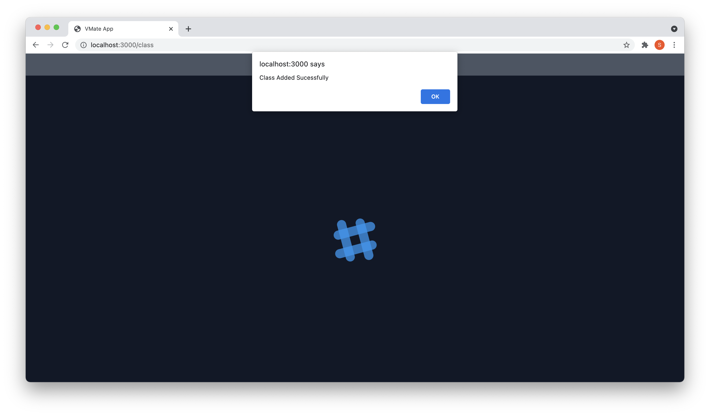

# Getting Started with VMate

This webapp is made for Assignment for Mortorq selection process.

## [Demo Of the Website](https://drive.google.com/file/d/1w6g-LfoVTvn4aVmb8_MTBQmvZEH6Ezu8/view?usp=sharing)

## Some Screenshots from the VMate Webapp.

### Login Page   

Enter Registration number and name to login. If not a user use the register option   
</img>

### Course List Page

Here You can see all courses avalable. And classes options and see on map option are also available.   
Registered class button takes you to classes registered.

</img>

### Registered Classes List Page

Here you can see all the registered classes and also delete/drop them if you want to.

</img>

### Deleting a Registered class

After clicking the delete button you can recieve any one of 2 alert.   
if you recieve `Deleted successfully`. The class is deleted.   
but if you recieve `Internal Server Error`. There is some problem at the server end time to notify the developers.

</img>

### After Deleting

After deleting a clss it will be removed from registered list.  
If there are no classes registered it will show no classes available.  

</img>

### Class List view

Here you can see all available classes for a particular course.

</img>

### Adding a class

If a class is not clashing with your already registered class timings. It will get added and show added sucessful but if the clashes class wont get registered and will return `Class Clash` alert.

</img>

### Map View for Classes

This section of website shows a map view for the list of classes under any course. By hovering on the marker you can see a popup menu showing details of the class.

</img>

## How to compile and run This webapp

This web app is already hosted on [VMate](https://vmate.herokuapp.com/). This deployment still have some issues to fix. Untill Then use the local run guide.

### Prerequisit
1. Install npm.
2. Goto [API](https://github.com/nexus-hash/API-for-VMate) for this web app and run it first using the guide mentioned in the Readme Section.

### Compiling VMate React App
1. Fork and then clone this repo.
2. Run the command `npm install`
3. Change `apiLink` under `src/api.js` variable to you local server link, make sure to have the same formatting.
3. After installing all dependencies and making the localserver online run `npm start`.
